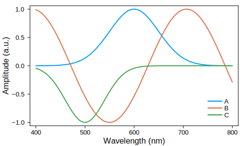
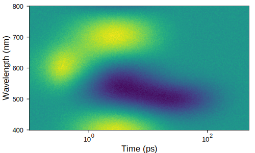
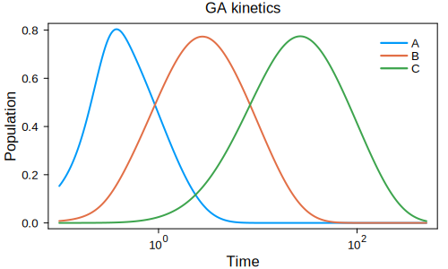
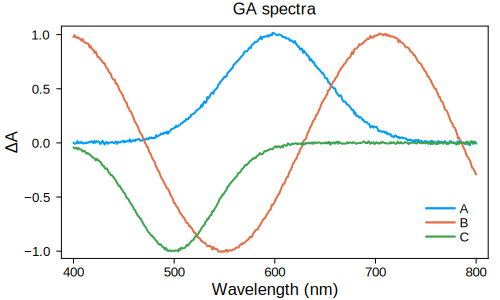
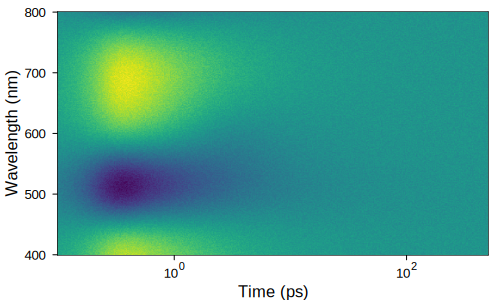
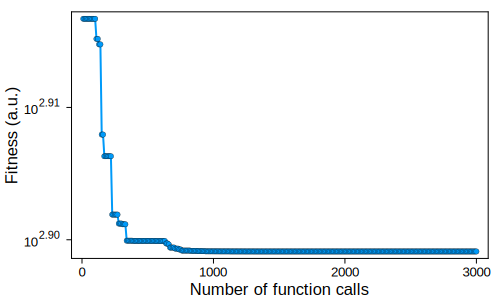
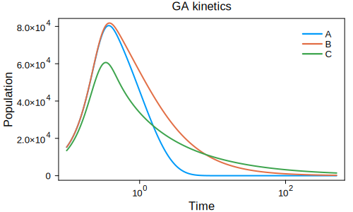
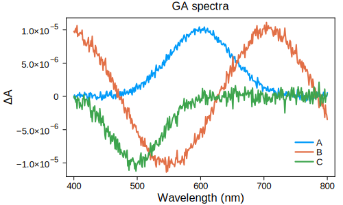

The kinetic model module offers the flexibility to specify custom kinetic models of any reaction order to extract the spectral signatures of physical species from experimental datasets.


## Model definition

We define kinetic models in the form of reaction networks as implemented in *Catalyst.jl*. *DifferentialEquations.jl* then generates the differential equations that describe the reaction network, optimizes them for simulation, and solves them numerically.

To illustrate the use of reaction networks, consider a Michaelis-Menten enzyme-catalyzed reaction:

```math
S + E \underset{k_{2}}{\overset{k_1}{\rightleftharpoons}} ES \xrightarrow{k_3} P + E
```

The enzyme `E` reacts with a substrate `S` to form an enzyme-substrate complex `ES`. `ES` can convert to `E` and product `P`, completing the enzymatic reaction, or decompose back to `S` and `E`. These reactions can be formulated as the following reaction network:

```julia
rn = @reaction_network begin
    k1, S + E --> SE
    k2, SE --> S + E
    k3, SE --> P + E
end
```

Note that each reaction has been assigned a rate constant `k1`, `k2`, or `k3`. In this way, use of the `@reaction_network` macro facilitates simple configuration of complicated reaction models. 

To numerically solve differential equations, we need the following pieces of information:

- The concentrations of the species involved in the reaction at the start of the simulation, typically chosen to be `t = 0`
- The values of the involved rate constants
- The time span over which to solve the differential equations


Let's choose a set of parameters for these values:
```julia
# initial conditions
u0 = [:S => 300, :E => 100, :SE => 0, :P => 0] 

# rate constants
p = [:k1 => 0.001, :k2 => 0.0001, :k3 => 0.1]

# time span
tspan = [0, 100]
```

After solving the differential equations generated from the reaction network we obtain the following reaction kinetics, showing the temporal evolution of the individual species' concentrations:


Some further examples of how to set up reaction networks can be found in the *Examples* section below. More detailed information is available in the [documentation of *Catalyst.jl*](https://docs.sciml.ai/Catalyst/stable/catalyst_functionality/dsl_description/).


## Instrument response function

While we can simulate our reaction kinetics to infinite time resolution, an experimental setup imposes a finite time resolution. To accurately reproduce experimental data, we therefore need to take into account the instrument response function (IRF) of the system.

IRFs are often approximated as a Gaussian with a defined center $μ$ and standard deviation $σ$, defining its position and width in time, respectively. This Gaussian is then convolved with the kinetic traces obtained from the differential equation solver. In the resulting convolved traces, $μ$ controls when signal onset occurs and $σ$ determines how sharply the signal sets on. Here, we can optimize both $μ$ and $σ$ as part of our within our fitting procedure.

## Fitting procedure

The kinetic module performs a global fit of a 2D dataset, which can be described as described as follows:
 

```math
\psi(t,\gamma) = \sum_{l=1}^{n_{comp}} c_l(t) \epsilon_l(\gamma)
```

Here, $\psi(t,\gamma)$ is the spectally and time resolved data, $c_l(t)$ is the population of species $l$ at time $t$, and $\epsilon_l(\gamma)$ is the spectral spectral signature of component $l$ at energy/wavelength/wavenumber $\gamma$. 

The global analysis procedure involves the following steps:

1. **Choose a kinetic model.** Use the `@reaction_network` macro to define a kinetic model.
1. **Generate kinetic traces.** Differential equations are generated from the reaction network and solved numerically.
1. **IRF convolution.** The kinetic traces are convolved with a Gaussian instrument response. 
1. **Recover spectral signatures.** The spectral signature for each simulated kinetic trace are produced from the experimental data using matrix division.
1. **Iterative optimization.** Parameters, rate constants, and instrument response parameters are varied iteratively to maximise the fit between simulated and experimental data.
1. **Refine kinetic model.** Tune the kinetic model based on physical intuition and fit quality.


## Examples

To illustrate the use of different kinetic models, we look at examples where we recover spectral signatures from synthetic data. For the purpose of these examples, we generate data comprising three different species. We first generate spectral signatures for our synthetic species, representing positive, negative, and mixed positive/negative signatures:



## Example: First-order sequential model

### Assembling synthetic data

We define a set of first order reaction kinetics where species `A` converts to `B`, `B` converts to `C`, and `C` decays to the ground state:

```math
A \xrightarrow{k_1} B \xrightarrow{k_2} C \xrightarrow{k_3} 0
```
The corresponding reaction network looks as follows:

```julia
# define kinetic model
rn = @reaction_network begin
    k1, A --> B
    k2, B --> C
    k3, C --> 0
end
```

Next we choose initial amplitudes, rate constants, and instrument response function parameters. Given the sequential nature of the reaction, `A` is initialised to `1`, whereas `B` and `C` are initialised to `0`. We set the rate constants in decreasing order `k1 = 1`, `k2 = 0.1`, `k3 = 0.01` as otherwise no buildup of species `B` and `C` is observed. Finally, we use a Gaussian as an IRF with an offset of `μ = 0.2` and a standard deviation of `σ = 0.1`.

```julia
 Dict(
    :A => 1,
    :B => 0,
    :C => 0,
    :k1 => 1,
    :k2 => 0.1,
    :k3 => 0.01,
    :μ => 0.2,
    :σ => 0.1
)
```
From these parameters, we obtain the following kinetic traces:


By matrix multiplying spectral signatures and kinetic traces, we generate a 2D dataset, which is the sum of the temporal evolutions of all three spectral components. In addition, some noise is added to replicate experimental conditions more closely. This dataset can be found in `\data\testData_first_order_seq.csv`.



### Global fit

The recovery of spectral signatures and experimental parameters from the generated synthetic dataset is shown in the example notebook `/notebooks/kineticModel.ipynb`.

For a global fit, we assume a kinetic model and test how well it fits the experimental data. Here, we know the used sequential model and thus define the reaction network `rn` and the initial amplitudes of the involved species as above. In the case of a reaction network composed solely of first order reactions, reaction rates are independent of the species' populations, meaning that it only matters whether a component is initialised with `0` or a non-zero value. 

Next, we define parameter bounds for the rate constants `k1`, `k2`, and `k3`. In the case of a sequential reaction, this typically involves adjacent parameter ranges as below. Similarly, we define parameter bounds for the IRF center `μ`, reflecting the onset of the signal with respect to `t = 0`, and the standard deviation `σ`, reflecting the width of the IRF.

```julia
limits = Dict(
    :A => 1,
    :B => 0,
    :C => 0,
    :k1 => [5e-1, 5],
    :k2 => [5e-2, 5e-1],
    :k3 => [5e-3, 5e-2],
    :μ => [-0.5, 0.5],
    :σ => [0.04, 0.2]
)
```

To run the global fit, we define the maximum number of iterations in the fit, for example `maxIter = 200` for 200 iterations, and then run the optimization routine. To judge whether an optimal solution has been found, we can monitor the convergence of the fit. Here, the chosen number of iterations resulted in 2000 function evaluations with no changes for the second half of those evaluations, which is a good indication that the fit has converged.


The fit returns the following parameters, demonstrating that the input parameters have been recovered successfully. Returned parameters are in the order of rate constants and then IRF parameters, e.g. in this case `k1`, `k2`, `k3`, `μ`, `σ`.

```
 0.9973429786752928
 0.10034827965186788
 0.010001260582309495
 0.1995665861641629
 0.09967374660755733
```
The optimized kinetics are essentially identical to the input above:



The optimized spectra closely resemble the input, except for the noise added to the synthetic dataset:




## Example: Mixed-order parallel model

### Assembling synthetic data

GlobalAnalysis.jl allows to perform a global fit involving non-first order reactions. In this example, we generate another synthetic dataset comprised of one first, one second, and one third order reaction. For example, common second and third order reactions for photogenerated charges are bimolecular recombination and Auger recombination, respectively. 

We define the following reaction network, in which all three reactions proceed in parallel:

```julia 
# define kinetic model
rn = @reaction_network begin
    k1, A --> 0
    k2, 2B --> 0
    k3, 3C --> 0
end
```

Unlike for first order reactions, the reaction rates of higher order reactions depend on the carrier concentration. As such, we need to assign physically meaningful initial carrier concentrations for our species in order to obtain physically meaningful rate constants. For example, let's assume we generate `A`, `B`, and `C` with initial concentrations of 1e17 $cm^{-3}$ - a common value for laser experiments. 

1e17 $cm^{-3}$ is a rather large number and may cause numerical difficulties, but we can convert it to a more manageable 1e5 $\mu m^{-3}$. Assuming that our time axis is in ps, we choose rate constants of 1 $ps^{-1}$ for the first-order `k1`, 1e-5 $\mu m^{3} ps^{-1}$ for the second-order `k2`, and 1e-9 $\mu m^{6} ps^{-1}$ for the third-order `k3`. The IRF parameters are the same as in the previous example.

```julia
Dict(
    :A => 1e5,
    :B => 1e5,
    :C => 1e5,
    :k1 => 1,
    :k2 => 1e-5,
    :k3 => 1e-9,
    :μ => 0.2,
    :σ => 0.1
)
```

This reaction network and parameters yield the following kinetic traces:


We use the same spectral signatures as above to generate a synthetic 2D dataset, again with added noise. The resulting dataset can be found in `\data\testData_mixed_order_par.csv`.




### Global fit

To set up the global fit, we first define our parameter bounds. These include the known initial concentration 1e5 $\mu m^{-3}$ of our species `A`, `B`, and `C` - for real data these can be estimated from the absorption of the studied sample and the used laser fluence. We provide expected ranges for the rate constants and IRF parameters, again keeping in mind the units defined by our initial concentrations and the time axis.

```julia
limits = Dict(
    :A => 1e5,
    :B => 1e5,
    :C => 1e5,
    :k1 => [0.5, 5],
    :k2 => [1e-4, 1e-6],
    :k3 => [1e-10, 1e-8],
    :μ => [-0.5, 0.5],
    :σ => [0.04, 0.2]
)
```

With `maxIter = 300`, we achieve a satisfactory convergence:



The input kinetics are recovered reliably:



Similarly, the spectral signatures are recovered, with an additional scaling factor arising from a normalization of the 2D data to keep the amplitudes in the data comparable to the first order example.




## Fixed parameters

Parameters in the `limits` dictionary can be fitted or fixed. A fit parameter is defined as a range of two numbers, setting the upper and lower bound for the fit. A fixed parameter is supplied as a single value.

For example, let's take the first-order sequential model above and assume we know that `k2 = 0.1`. `k2` can therefore be included as a single value in `limits`, indicating that it has a fixed value:

```julia
limits = Dict(
    :A => 1,
    :B => 0,
    :C => 0,
    :k1 => [5e-1, 5],
    # k2 now fixed
    :k2 => 0.1, 
    :k3 => [5e-3, 5e-2],
    :μ => [-0.5, 0.5],
    :σ => [0.04, 0.2]
)
```

The returned fit parameters are now `k1`, `k3`, `μ`, `σ`:
```
 0.9987864025253465
 0.010011635105851064
 0.19962871764921578
 0.09973821246066149
```

## Model refinement

Refining a kinetic model is an iterative process. It is often necessary to test several different models as well as different parameter bounds in order to achieve an satisfactory fit. 

The kinetic model notebook produces residual maps, illustrating the difference between the the achieved fit and the experimental data. In the ideal case the residual map will only contain noise, as the fit fully captures the features in the experimental data. If features are observed in the residual maps this means there are aspects of the data not captured by the used kinetic model within the chosen parameter bounds, and the amplitude of these residual features can be used to guide the refinement of the model and/or its parameters. 
