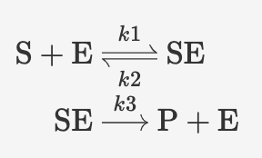
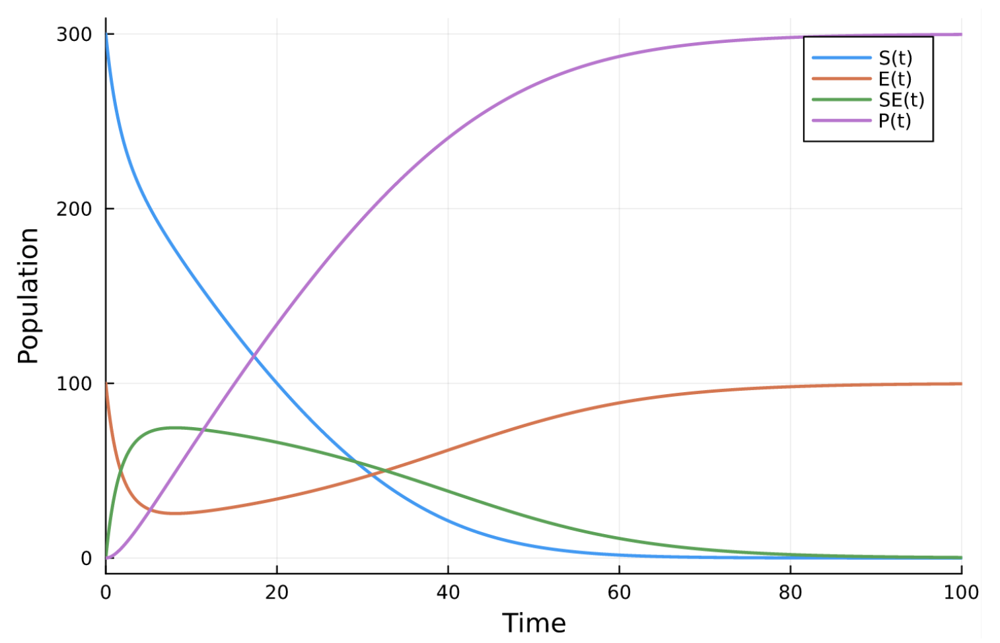
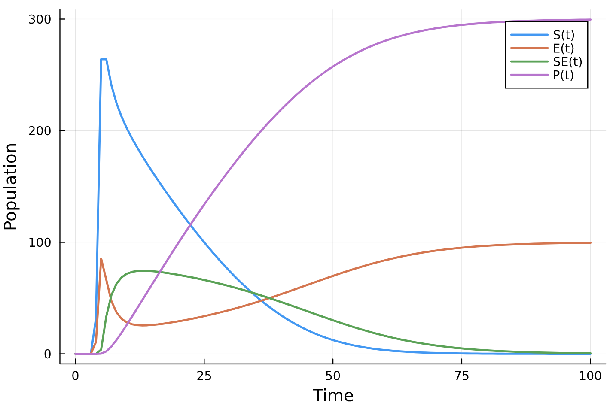
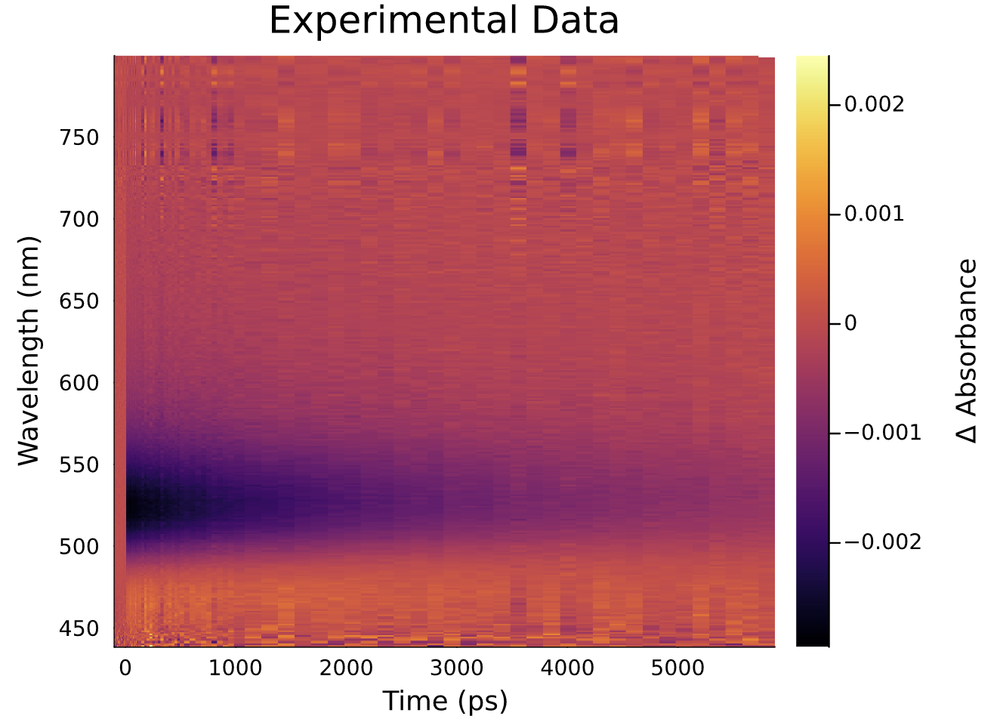
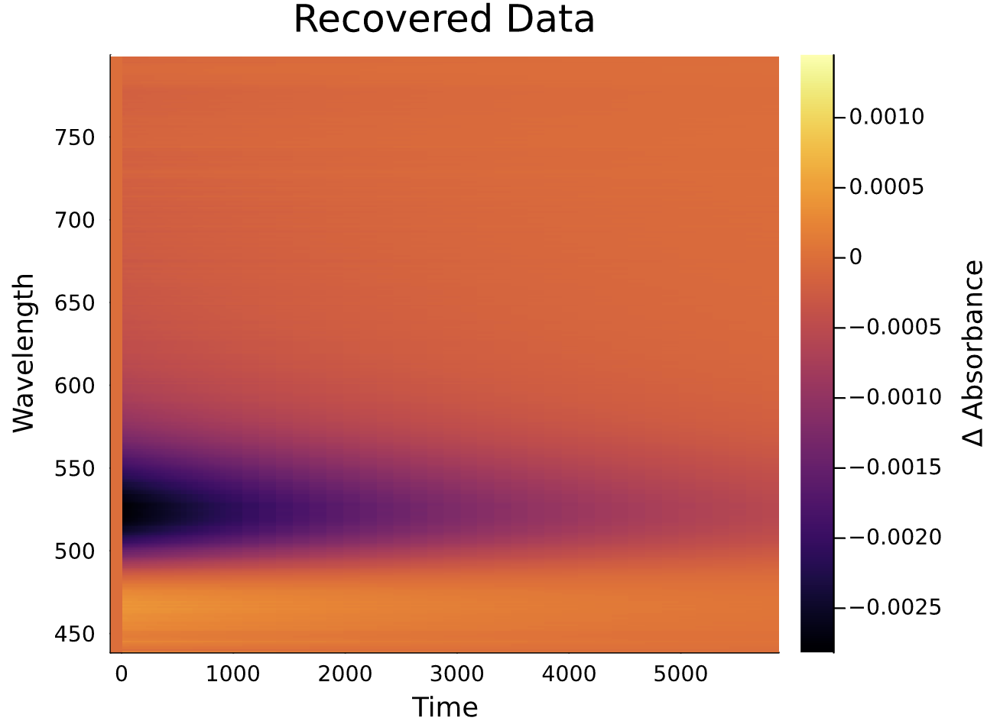
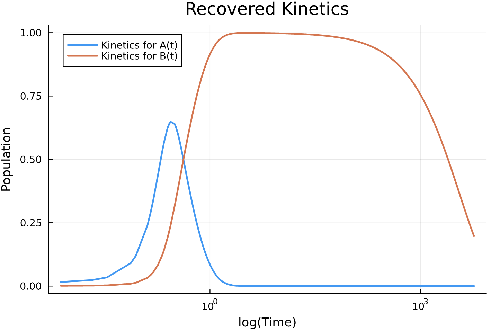
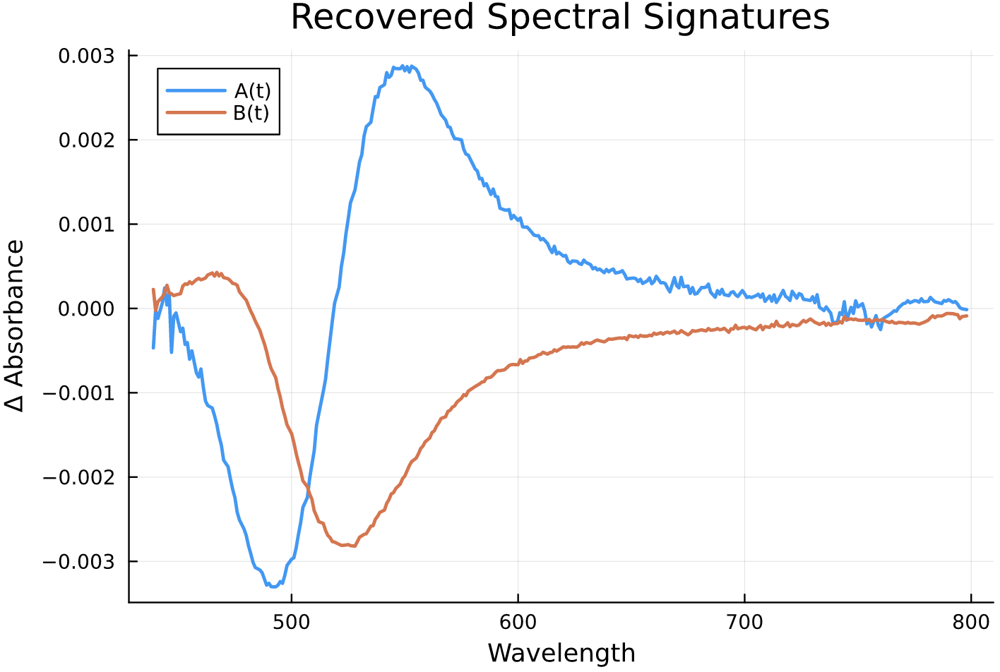

# KineticModel.jl: Streamlining Complex Spectroscopic Data Analysis with Julia

KineticModel.jl is a powerful software package designed to simplify the analysis of intricate spectroscopic data. It offers the flexibility to specify custom kinetic models of any order while efficiently extracting spectral signatures from experimental datasets.

## 1. Installation

## 2. Getting Started
KineticModel.jl heavily relies on the Catalyst.jl and DifferentialEquations.jl packages. Catalyst.jl facilitates the definition of kinetic models by breaking down complex reactions into distinct components associated with rate constants. DifferentialEquations.jl automatically generates the corresponding differential equations and optimizes them for numerical simulation.

### Specifying Kinetic Models with Catalyst.jl

To illustrate the process, consider the Michaelis-Menten enzyme-catalyzed reaction. 

<!--  -->


The enzyme (E) reacts with a substrate (S) to form an enzyme-substrate complex (ES), followed by ES decomposition into restored E and new product P. Using Catalyst.jl, you define the kinetic model as a reaction system:


```julia
rn = @reaction_network begin
    k1, S + E --> SE
    k2, SE --> S + E
    k3, SE --> P + E
end
```
Use of the @reaction_network macro facilitates simple configuration of complicated reaction models. 

### Simulating Kinetics with DifferentialEquations.jl

DifferentialEquations.jl generates and solves the corresponding system of differential equations for the kinetic model. For example, the Michaelis-Menten equations are:

$$\displaystyle
\frac{dS(t)}{dt} = k_2 SE(t) - k_1 E(t) S(t)$$

$$\displaystyle
\frac{dE(t)}{dt} = k_2 SE(t) + k_3 SE(t) - k_1 E(t) S(t)$$

$$\displaystyle
\frac{dSE(t)}{dt} = k_1 E(t) S(t) - k_2 SE(t) - k_3 SE(t)$$

$$\displaystyle
\frac{dP(t)}{dt} = k_3 SE(t)$$

These equations describe the kinetics of each component in the reaction.

To make DifferetialEquations.jl generate and solve these equations (i.e., to simulate the kinetic model), there is information that needs to be provided to the simulator in a specific format:

1. The initial condition: the amplitudes of each species/component at the beginning of the simulation. This is given as a vector u0.

2. Parameter values: the values of the rate constants. This is given as a vector p.

3. Time span for which we run the simulation. 

For example, one might specify the following conditions to simulate the Michaelis-Menten reaction system defined above:

```julia
# initial conditions
u0 = [:S => 300, :E => 100, :SE => 0, :P => 0] 

# rate constant parameters
p = (:k1 => 0.00166, :k2 => 0.0001, :k3 => 0.1)

# time for simulation
tspan = (0, 100)

# set up differential equation
prob = ODEProblem(rn, u0, tspan, p)

# solve differential equation
sol  = solve(prob, Tsit5())

# plot the solutions
plot(sol, legend=:topright, xaxis="Time", yaxis="Population", linewidth=2)
```

<!--  -->


This plot shows the four kinetic traces associated with the four species in this kinetic model, i.e., solutions to the differential equations at the specified conditions. 

### Incorporating Instrument Response Functions (IRFs)

In theory, we can calculate our kinetics to infinite time resolution, yet in practice, we encounter a limit to time resolution which is defined by the instrument setup. Rather than having a sharp signal onset, the instrument response causes the onset to be smeared out. If we want to fit our experimental data to an appropriate model, we need to account for this response. Mathematically, this is done through convolution. In KineticModel.jl, we convolve the instrument response with a Gaussian which has a defined position $μ$ (which may be slightly different from 0.0) and width $σ$. In the case of the Michaelis-Menten reaction system, our kinetic traces will be convolved.

<!--  -->


Here, $μ$ and  $σ$ are parameters to be optimized within our fitting procedure. 

## 3. Using KineticModel.jl: A Step-by-Step Tutorial

KineticModel.jl offers a step-by-step procedure for global analysis, providing a robust framework to streamline the analysis of complex spectroscopic data. This tutorial guides you through the general process, from defining kinetic models to optimizing parameters for the best fit.


### General Procedure
KineticModel.jl follows a general procedure for global analysis, described by the equation:
 
$$
\displaystyle
\psi(t,\gamma) = \sum_{l=1}^{n_{comp}} c_l(t) \epsilon_l(\gamma)
$$

Here,  $\psi(t,\gamma)$ is the two-way time-resolved spectrum,  $c_l(t)$ is the kinetic model, and $\epsilon_l(\gamma)$ is the spectral model. The process involves:

1. **Defining a Kinetic Model:** Utilize Catalyst.jl to define a kinetic model and solve for the corresponding spectral model.
2. **Multiplying Simulated Data:** Multiply the simulated kinetics with the simulated spectral signatures to reproduce the experimental data.
3. **Iterative Optimization:** Adjust kinetic model parameters iteratively to minimize differences between simulated and experimental data.


### Required User Input
Let's dive into a practical example of how to use KineticModel.jl using a specific use case. Assume you have experimental data:

```julia
RealData = importData("path/to/data/"; miss="NaN")
```

Now, let's say you hypothesize that the system follows a first-order reaction with two rate constants. Here's how you can set up a "guess" kinetic model using Catalyst.jl:

```julia
# define a kinetic model
rs = @reaction_network begin
    k1, A --> B
    k2, B --> 0
end
```


Even if you lack explicit prior knowledge about parameter values ($u0 = [A, B]$ and $p =  [k_1, k_2]$), KineticModel.jl allows you to optimize the parameters without needing precise initial values. You need only define upper and lower bounds for optimization:


```julia
# Define bounds for the parameter optimization 

# Species A, B 
state_lower =  [ A_low , B_low]
state_upper = [A_up, B_up] 

# IRF μ, σ
IRF_lower = [μ_low, σ_low]
IRF_upper = [μ_up, σ_up]

# rate constants k1, k2
rate_const_lower = [k1_low, k2_low]
rate_const_upper = [k1_up, k2_up]

# replace place-holders with numerical values
```
Specification of a kinetic model and the parameter bounds are the **only** necessary required user inputs. The remainder of the procedure is entirely automated. 

### Fitting Procedure
With these inputs in place, you're ready to start simulating. The fitting procedure involves several key steps:

1. **Simulation:** Simulate the kinetic model using specified conditions and obtain an array of kinetic traces.
2. **Convolution:** Convolve the kinetic traces with the instrument response function (IRF) parameters to model experimental smearing.
3. **Spectral Signatures:** Extract spectral signatures from the simulated data using matrix division.
4. **Objective Function:** Calculate the sum of squared differences (residual) between simulated and experimental data.
5. **Parameter Optimization:** Adjust parameters iteratively (species amplitudes and rate constants) to minimize the residual value.


## 4. Examples
### 1st Order 

**Step 1: Importing and Initial Predictions**

Start by importing your experimental data.
```julia
# import data
RealData = importData("/path/to/data"; miss="NaN")
```
<!--  -->


Suppose you predict this system will follow a first-order reaction with two rate constants. Define your kinetic model, using Catalyst.jl, based on this prediction.

```julia
# define a kinetic model
rs = @reaction_network begin
    k1, A --> B
    k2, B --> 0
end
```
**Step 2: Parameter Bounds**

Next, make a prediction for the parameter bounds. KineticModel.jl can adeptly handle bounds ranges that are quite wide, making the analysis robust and flexible.

```julia
# Define bounds for the parameter optimization 
state_lower = [1, 0] # A, B, C
state_upper = [1, 0] 

IRF_lower = [0.1, 0.01] # μ, σ
IRF_upper = [0.2, 0.08]

rate_const_lower = [1, 0.0001] # k1, k2, k3, ...
rate_const_upper = [10, 0.0010]
```

**Step 3: Fitting Procedure**

Finally, you can run the fitting procedure. KineticModel.jl optimizes your parameter set efficiently and returns an array of optimized parameters:


```julia
# Run the fitting procedure
OP = bboptimize(Objective; SearchRange = bounds)
```
From this optimization, retrieve the best set of parameters to be used for further analysis:

```julia
# recover optimized parameter vector
RecoveredParam = best_candidate(OP) 
```

**Step 4: Plotting Results**

Using the optimized parameter vector, you can recover the simulated kinetics, spectral signatures, and data matrix.

```julia
# Plug optimized parameters into GetData
RecoveredData = GetData(RecoveredParam) 

# Data matrix
DataMatrix = RecoveredData[1] 

# Spectral signatures
RecoveredSpec = RecoveredData[2] 

# Kinetic
RecoveredKinetics = RecoveredData[3] 
```
Visualize your results for easy comparison with experimental data. 

```julia
# heatmap of recovered data
heatmap(time, wavelength, DataMatrix, xlabel="Time", ylabel="Wavelength", 
    title="Recovered Data", colorbar_title=" Δ Absorbance")
```

<!--  -->


```julia
# kinetics
tpos = time.>0

plot(time[tpos], RecoveredKinetics[1,:][tpos], xscale=:log10,
     title="Recovered Kinetics", xlabel="log(Time)", legend=:topleft, ylabel="Population",
     linewidth = 2, xguidefontsize=10, yguidefontsize=10, label="Kinetics for A(t)")

plot!(time[tpos], RecoveredKinetics[2,:][tpos], xscale=:log10,
     linewidth = 2, xguidefontsize=10, yguidefontsize=10, label="Kinetics for B(t)")

```
<!--  -->


```julia
# Spectral Signatures
plot(wavelength, RecoveredSpec[:,1], title="Recovered Spectral Signatures", xlabel="Wavelength", label="A(t)", ylabel="Δ Absorbance" ) 

plot!(wavelength, RecoveredSpec[:,2], label="B(t)" ) 
```

<!--  -->


**Step 5: Refining Models with Residual Maps**

We recognize that refining a kinetic model can be a difficult and iterative process. It is often necessary to test several different models in order to achieve an optimal fit. For this reason, we created an additional feature called a "residual map", which plots the difference between your simulated data and experimental data. 
``` julia
# residual maps 
map = Objective(RecoveredParam; output="map")
```
<!--  -->


By plotting the residual map for each variation of kinetic model you test, it is easy to quantitatively compare those models and determine which is best. Ideally, you want the residual map to just be noise. 

